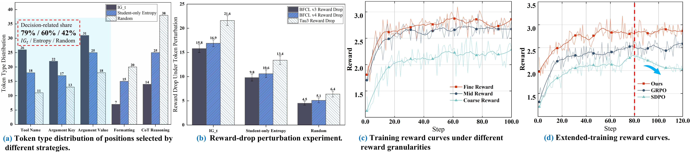
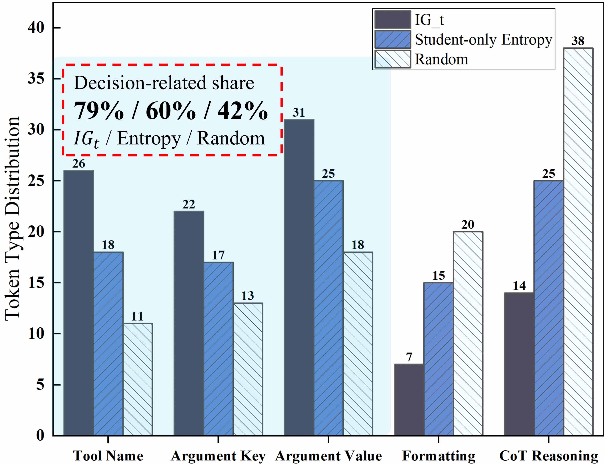
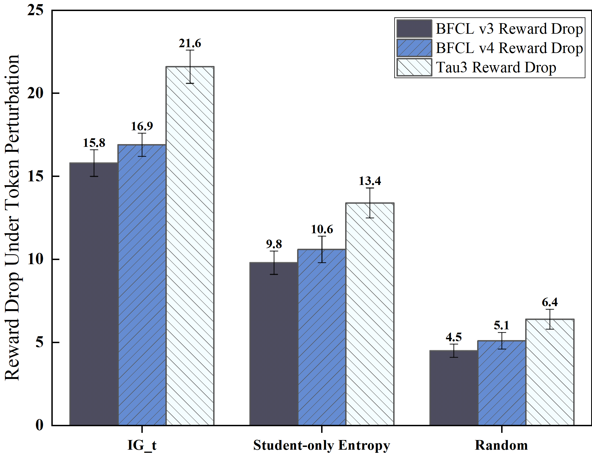

# Correctable Fork Tokens (CFT)

This repository contains the code for **Correctable Fork Tokens (CFT)**, a selective credit-assignment method for tool-integrated reinforcement learning with verifiable rewards (RLVR).

## Overview

**CFT** uses a **training-only, answer-conditioned branch** to estimate where a rollout contains **correctable decision forks**. The information gap

$$
IG_t = H_S(t) - H_T(t \mid \mathrm{priv})
$$

selects high-value token positions, while **asymmetric KL reweighting** changes credit magnitude without replacing the **verifier advantage** as the update-direction signal.

## Key results

Results below use the **Qwen3-4B-Thinking-2507** backbone and report **mean ± standard deviation over three seeds**.

| **Benchmark / metric** | **CFT** | **GRPO** | **Gain** |
| --- | ---: | ---: | ---: |
| **BFCL v3 Overall** | **74.37 ± 0.29** | 71.25 ± 0.37 | **+3.12 pp** |
| **BFCL v3 Multi-turn** | **51.41 ± 0.36** | 47.17 ± 0.69 | **+4.24 pp** |
| **BFCL v4 Overall** | **43.41 ± 0.16** | 41.25 ± 0.26 | **+2.16 pp** |
| **BFCL v4 Multi-turn** | **59.00 ± 0.43** | 52.46 ± 0.73 | **+6.54 pp** |
| **Tau3 Overall** | **53.10 ± 0.40** | 44.77 ± 0.63 | **+8.33 pp** |

## Repository layout

- `CFT/`: model, loss, dataset, Ray, and DeepSpeed components.
- `examples/python/`: reward and evaluation helpers, including `CFT.py`.
- `examples/scripts/`: training entry points such as `train_ours.sh`, `train_test_grpo.sh`, `train_test_dapo.sh`, `train_test_opsd.sh`, `train_sdpo.sh`, `train_onPolicyDistilled.sh`, and `train_test_sft.sh`.
- `CFT/datasets/data/`: training data used by the example configurations.

## Environment

The code is based on **OpenRLHF `v0.9.5`**, with the CFT training and credit-assignment changes layered on top. The installation follows the **OpenRLHF `v0.9.5` setup**.

### **Docker installation (recommended)**

```bash
docker run --runtime=nvidia -it --rm --shm-size="10g" --cap-add=SYS_ADMIN \
  -v $PWD:/openrlhf nvcr.io/nvidia/pytorch:25.11-py3 bash

sudo pip uninstall xgboost transformer_engine flash_attn pynvml -y
pip install "openrlhf[vllm]==0.9.5"
```

### **Source installation**

```bash
git clone --branch v0.9.5 --depth 1 \
  https://github.com/OpenRLHF/OpenRLHF.git
cd OpenRLHF
pip install -e ".[vllm]"
```

The **`vllm` extra** installs the version used by OpenRLHF `v0.9.5`; install the **`ring`** or **`liger`** extras only when the selected script requires them. CFT does not provide a separate `setup.py` or `pyproject.toml`, so run its modules from the CFT repository root after installing the dependencies:

```bash
python -m CFT.cli.train_ppo_ray ...
```

The installation commands follow the [OpenRLHF v0.9.5 README](https://raw.githubusercontent.com/OpenRLHF/OpenRLHF/v0.9.5/README.md), [setup.py](https://raw.githubusercontent.com/OpenRLHF/OpenRLHF/v0.9.5/setup.py), and [requirements.txt](https://raw.githubusercontent.com/OpenRLHF/OpenRLHF/v0.9.5/requirements.txt). In that release, the **`vllm` extra resolves to `vllm==0.17.0`**.

## Figures

The following figures are reproduced from the accompanying paper.

### CFT overview


The overview shows **answer-conditioned fork localization** and **asymmetric token-level credit weighting** for multi-turn tool interactions.

### Performance and mechanism analysis



This figure summarizes the **token-selection, perturbation, reward-granularity, and extended-training analyses**.

### Token-type distribution



The **$IG_t$ selector** concentrates more selected positions on **structured decision tokens** than entropy-only and random selection.

### Reward-drop perturbation



Perturbing **$IG_t$-selected positions** produces the **largest reward drop** across the evaluated benchmarks.

## Running the examples

Prepare the **Qwen3-4B-Thinking-2507 checkpoint** and the dataset referenced by the scripts. Then update **`EXPERIMENT_PATH`**, model paths, output paths, and GPU settings in the selected script before running it from the repository root:

```bash
bash examples/scripts/train_ours.sh
```

The other scripts in `examples/scripts/` provide configurations for the listed baselines. Full reproduction requires the corresponding model weights, data, and multi-GPU environment.
